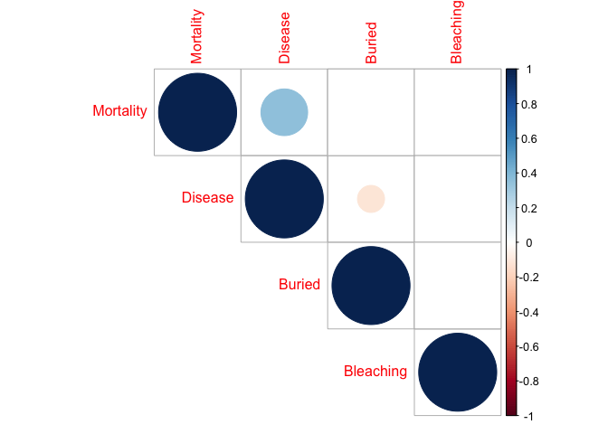
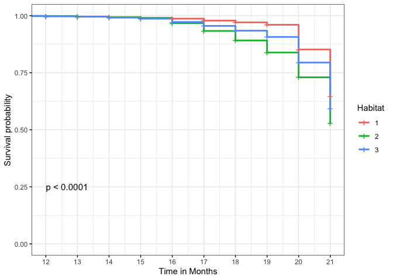
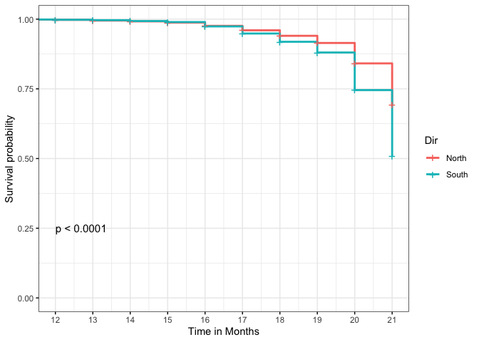
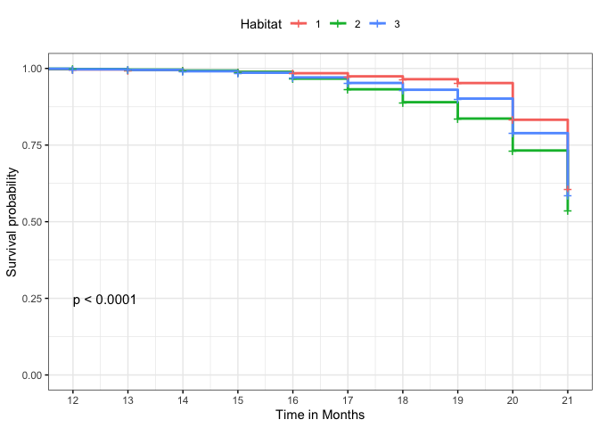
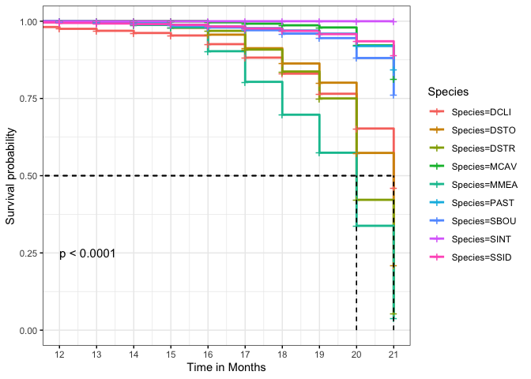

Survival Analyses
================

Markdown code for the survival analyses of the Port of Miami data
examining the main effects of channel (i.e. dredging impact), reef
habitat, and direction. Survival analyses used to tease apart species
specific differences as well as the impact of state (or condition)
specifically whether the corals were observed to be buried, bleached or
diseased. Each variable is coded as 0 (absence) or 1 (presence) as well
as in combination in the states column.

``` r
rm(list = ls())
knitr::opts_chunk$set(echo = TRUE, error = FALSE, fig.path='Figures/', dev=c('png', 'pdf'))
```

All figures exported to Figures/folder as png and pdf

``` r
library(knitr)
library(survival)
library(coda)
library(survminer)
```

    ## Loading required package: ggplot2

    ## Loading required package: ggpubr

``` r
library(dplyr)
```

    ## 
    ## Attaching package: 'dplyr'

    ## The following objects are masked from 'package:stats':
    ## 
    ##     filter, lag

    ## The following objects are masked from 'package:base':
    ## 
    ##     intersect, setdiff, setequal, union

``` r
library(ggplot2)
library(car)
```

    ## Loading required package: carData

    ## 
    ## Attaching package: 'car'

    ## The following object is masked from 'package:dplyr':
    ## 
    ##     recode

``` r
library(tidyverse)
```

    ## ── Attaching packages ─────────────────────────────────────── tidyverse 1.3.0 ──

    ## ✓ tibble  3.0.4     ✓ purrr   0.3.4
    ## ✓ tidyr   1.1.2     ✓ stringr 1.4.0
    ## ✓ readr   1.4.0     ✓ forcats 0.5.0

    ## ── Conflicts ────────────────────────────────────────── tidyverse_conflicts() ──
    ## x dplyr::filter() masks stats::filter()
    ## x dplyr::lag()    masks stats::lag()
    ## x car::recode()   masks dplyr::recode()
    ## x purrr::some()   masks car::some()

``` r
library(kableExtra)
```

    ## 
    ## Attaching package: 'kableExtra'

    ## The following object is masked from 'package:dplyr':
    ## 
    ##     group_rows

``` r
#library(gtsummary) #not loading properly
```

``` r
df_surv=read.csv("fl_surv_minusMIS.csv") #time by months; excludes missing corals
df_status=read.csv("state_data.csv") #pulls in state data
df <- merge(df_surv, df_status, by.x = "ID", by.y = "Coral") #merge dataframes
#glimpse(df)
```

``` r
#Select 
df_corr <- df %>% select(Mortality, Buried, Disease, Bleaching)
head(df_corr)
```

    ##   Mortality Buried Disease Bleaching
    ## 1         0      5       0         0
    ## 2         0      5       0         0
    ## 3         0      5       0         0
    ## 4         0      5       0         0
    ## 5         0      5       0         0
    ## 6         0      5       0         0

``` r
res <- cor(df_corr)
round(res,2)
```

    ##           Mortality Buried Disease Bleaching
    ## Mortality      1.00  -0.06    0.36      0.01
    ## Buried        -0.06   1.00   -0.12     -0.01
    ## Disease        0.36  -0.12    1.00     -0.05
    ## Bleaching      0.01  -0.01   -0.05      1.00

``` r
library(Hmisc)
```

    ## Loading required package: lattice

    ## Loading required package: Formula

    ## 
    ## Attaching package: 'Hmisc'

    ## The following objects are masked from 'package:dplyr':
    ## 
    ##     src, summarize

    ## The following objects are masked from 'package:base':
    ## 
    ##     format.pval, units

``` r
res2 <-rcorr(as.matrix(df_corr))
res2
```

    ##           Mortality Buried Disease Bleaching
    ## Mortality      1.00  -0.06    0.36      0.01
    ## Buried        -0.06   1.00   -0.12     -0.01
    ## Disease        0.36  -0.12    1.00     -0.05
    ## Bleaching      0.01  -0.01   -0.05      1.00
    ## 
    ## n= 615 
    ## 
    ## 
    ## P
    ##           Mortality Buried Disease Bleaching
    ## Mortality           0.1316 0.0000  0.8718   
    ## Buried    0.1316           0.0029  0.8676   
    ## Disease   0.0000    0.0029         0.2182   
    ## Bleaching 0.8718    0.8676 0.2182

``` r
library(corrplot)
```

    ## corrplot 0.84 loaded

``` r
corrplot(res, type = "upper", order = "hclust",
         tl.col = "black", tl.srt = 45)
```

<!-- -->

``` r
# Insignificant correlation are crossed
corrplot(res2$r, type="upper", order="hclust", 
         p.mat = res2$P, sig.level = 0.01, insig = "blank")
# Insignificant correlations are leaved blank
corrplot(res2$r, type="upper", order="hclust", 
         p.mat = res2$P, sig.level = 0.01, insig = "blank")
```

<!-- -->

``` r
#states column codes 
#Disease = 1
#Bleaching = 3
#Buried = 5
#Additive combos
#xtabs(~States+Mortality, data = df)
```

0 = no observed condition; 1 = diseased; 3 = bleaching; 5 = buried; and
then additive combos to produce unique numbers. Condider recoding
numbers to unique states.

``` r
xtabs(~Species+States, data = df)
```

    ##         States
    ## Species   0  1  3  4  5  6  8
    ##   AAGA    0  0  1  0  0  0  0
    ##   ACER    4  0  0  0  0  0  0
    ##   AGA SP  1  0  0  0  0  0  0
    ##   ALAM    0  1  0  0  0  0  0
    ##   CNAT    4  5  1  0  0  0  0
    ##   DCLI   13  4  0  0  0  0  0
    ##   DLAB    1  1  0  0  0  0  0
    ##   DSTO   47 23  1  0  2  1  0
    ##   DSTR    7  8  1  0  0  0  0
    ##   MCAV   59 27  5  2  0  0  0
    ##   MDEC    0  1  0  0  0  0  0
    ##   MFER    0  0  1  0  0  0  0
    ##   MMEA   22 18  5  6  0  0  0
    ##   ODIF    5  0  1  0  0  0  0
    ##   OFAV    3  0  0  0  0  0  0
    ##   PAST   75  1 13  0  5  0  2
    ##   PPOR    2  0  1  0  0  0  0
    ##   SBOU   89 13  0  1  6  0  1
    ##   SIDSP   2  0  0  0 19  0  1
    ##   SINT   18  0 19  0  4  0  0
    ##   SSID   49  0  7  0  5  0  1

Table shows the conditions by species where disease is a focus of this
analysis including species specific patterns of disease susceptibility
to SCTLD in particular.

``` r
#Makes data.frame into long format for survival analyses
df_long <- gather(df,
                   key = "months",
                   value = "census",
                   X0:X21)
df1 <- df_long %>% mutate(months = as.numeric(gsub("X", "", months)))
```

``` r
# Fit Cox Model
cox_fit<- coxph(Surv(months, census)~ Channel + Habitat + Dir, data=df1)
cox_fit
```

    ## Call:
    ## coxph(formula = Surv(months, census) ~ Channel + Habitat + Dir, 
    ##     data = df1)
    ## 
    ##                     coef exp(coef)  se(coef)      z        p
    ## Channelcontrol -0.009342  0.990701  0.082473 -0.113   0.9098
    ## Habitat         0.109735  1.115982  0.052141  2.105   0.0353
    ## DirS            0.464572  1.591333  0.087411  5.315 1.07e-07
    ## 
    ## Likelihood ratio test=37.53  on 3 df, p=3.558e-08
    ## n= 13530, number of events= 621

Double check, but exp(coef) is the relative hazards ratio and its se.
Not sure what the HR is for habitat which should have 3 states?

``` r
Anova(cox_fit)
```

    ## Analysis of Deviance Table (Type II tests)
    ##         LR Chisq Df Pr(>Chisq)    
    ## Channel   0.0128  1    0.90980    
    ## Habitat   4.4386  1    0.03514 *  
    ## Dir      29.6362  1  5.212e-08 ***
    ## ---
    ## Signif. codes:  0 '***' 0.001 '**' 0.01 '*' 0.05 '.' 0.1 ' ' 1

NS channel effect on mortality, but Habitat and Direction both
significant.

``` r
ggsurvplot(
  survfit(Surv(months, census)~ Habitat, data=df1),  # survfit object with calculated statistics
  pval = TRUE, pval.size = 4, # show p-value of log-rank test.
  #conf.int = TRUE, conf.int.style = "step", # customize style of confidence intervals
  xlab = "Time in Months",  # customize X axis label.
  break.time.by = 1,    # break X axis in time intervals by 200.
  ggtheme = theme_bw(), 
  xlim= c(12, 21),# customize plot and risk table with a theme.
  pval.coord = c(12,0.25),
  #surv.median.line = "hv",  # add the median survival pointer.
  legend = c("right"),
  legend.title = "Habitat",
  legend.labs = c("1", "2", "3"),    # change legend labels.
  #palette = c("#E7B800", "#2E9FDF"), # custom color palettes
  
  #risk.table = "percentage",  # absolute number and percentage at risk.
  #risk.table.fontsize = 3,# colour risk table text annotations.
  #risk.table.y.text = FALSE,# show bars instead of names in text annotations
  #ncensor.plot = TRUE      # plot the number of censored subjects at time t
)
```

<!-- -->

``` r
ggsurvplot(
  survfit(Surv(months, census)~ Dir, data=df1),  # survfit object with calculated statistics
  pval = TRUE, pval.size = 4, # show p-value of log-rank test.
  #conf.int = TRUE, conf.int.style = "step", # customize style of confidence intervals
  xlab = "Time in Months",  # customize X axis label.
  break.time.by = 1,    # break X axis in time intervals by 200.
  ggtheme = theme_bw(), 
  xlim= c(12, 21),# customize plot and risk table with a theme.
  pval.coord = c(12,0.25),
  #surv.median.line = "hv",  # add the median survival pointer.
  legend = c("right"),
  legend.title = "Dir",
  legend.labs = c("North", "South"),    # change legend labels.
  #palette = c("#E7B800", "#2E9FDF"), # custom color palettes
  
  #risk.table = "absolute",  # absolute number and percentage at risk.
  #risk.table.fontsize = 3,# colour risk table text annotations.
  #risk.table.y.text = FALSE,# show bars instead of names in text annotations
  #ncensor.plot = TRUE      # plot the number of censored subjects at time t
)
```

<!-- -->

Survival analyses focused on 9 most common species

``` r
#15 or more
df_commons <- df1 %>% filter(Species %in% c("DCLI", "DSTO", "DSTR", "MCAV", "MMEA", "PAST", "SBOU", "SINT", "SSID")) #keeping only the 9 most common species 
#xtabs(~Species+Channel, data = df_commons)
```

``` r
# Fit Cox Model
cox_fit2 <- coxph(Surv(months, census)~ Channel + Habitat + Dir + Species, data=df_commons)
```

    ## Warning in fitter(X, Y, istrat, offset, init, control, weights = weights, :
    ## Loglik converged before variable 10 ; coefficient may be infinite.

``` r
cox_fit2
```

    ## Call:
    ## coxph(formula = Surv(months, census) ~ Channel + Habitat + Dir + 
    ##     Species, data = df_commons)
    ## 
    ##                      coef  exp(coef)   se(coef)      z        p
    ## Channelcontrol -1.025e-01  9.026e-01  8.774e-02 -1.168 0.242880
    ## Habitat         3.578e-01  1.430e+00  6.588e-02  5.431 5.60e-08
    ## DirS           -9.195e-02  9.121e-01  9.035e-02 -1.018 0.308823
    ## SpeciesDSTO     2.486e-01  1.282e+00  1.918e-01  1.296 0.194940
    ## SpeciesDSTR     2.419e-01  1.274e+00  2.371e-01  1.020 0.307677
    ## SpeciesMCAV    -2.077e+00  1.254e-01  2.572e-01 -8.074 6.79e-16
    ## SpeciesMMEA     6.442e-01  1.905e+00  1.943e-01  3.316 0.000912
    ## SpeciesPAST    -2.064e+00  1.269e-01  2.499e-01 -8.258  < 2e-16
    ## SpeciesSBOU    -1.439e+00  2.372e-01  2.190e-01 -6.570 5.05e-11
    ## SpeciesSINT    -1.838e+01  1.044e-08  9.570e+02 -0.019 0.984679
    ## SpeciesSSID    -2.026e+00  1.318e-01  2.826e-01 -7.171 7.46e-13
    ## 
    ## Likelihood ratio test=761.2  on 11 df, p=< 2.2e-16
    ## n= 12320, number of events= 591

``` r
Anova(cox_fit2)
```

    ## Warning in fitter(X, Y, istrat, offset, init, control, weights = weights, :
    ## Loglik converged before variable 9 ; coefficient may be infinite.

    ## Warning in fitter(X, Y, istrat, offset, init, control, weights = weights, :
    ## Loglik converged before variable 9 ; coefficient may be infinite.

    ## Warning in fitter(X, Y, istrat, offset, init, control, weights = weights, :
    ## Loglik converged before variable 9 ; coefficient may be infinite.

    ## Analysis of Deviance Table (Type II tests)
    ##         LR Chisq Df Pr(>Chisq)    
    ## Channel     1.37  1     0.2424    
    ## Habitat    29.50  1  5.581e-08 ***
    ## Dir         1.03  1     0.3113    
    ## Species   738.94  8  < 2.2e-16 ***
    ## ---
    ## Signif. codes:  0 '***' 0.001 '**' 0.01 '*' 0.05 '.' 0.1 ' ' 1

Species then Habitat significant.

``` r
ggsurvplot(
  survfit(Surv(months, census)~ Habitat, data=df_commons),  # survfit object with calculated statistics
  pval = TRUE, pval.size = 4, # show p-value of log-rank test.
  #conf.int = TRUE, conf.int.style = "step", # customize style of confidence intervals
  xlab = "Time in Months",  # customize X axis label.
  break.time.by = 1,    # break X axis in time intervals by 200.
  ggtheme = theme_bw(), 
  xlim= c(12, 21),# customize plot and risk table with a theme.
  pval.coord = c(12,0.25),
  surv.median.line = "hv",  # add the median survival pointer.
  legend = c("top"),
  legend.title = "Habitat",
  legend.labs = c("1", "2", "3"),    # change legend labels.
  #palette = c("black", "red"), # custom color palettes
  
  #risk.table = "percentage",  # absolute number and percentage at risk.
  #risk.table.fontsize = 3,# colour risk table text annotations.
  #risk.table.y.text = FALSE,# show bars instead of names in text annotations
  #ncensor.plot = TRUE      # plot the number of censored subjects at time t
)
```

    ## Warning in .add_surv_median(p, fit, type = surv.median.line, fun = fun, : Median
    ## survival not reached.

<!-- -->

``` r
ggsurvplot(
  survfit(Surv(months, census)~ Species, data=df_commons),  # survfit object with calculated statistics
  pval = TRUE, pval.size = 4, # show p-value of log-rank test.
  #conf.int = TRUE, conf.int.style = "step", # customize style of confidence intervals
  xlab = "Time in Months",  # customize X axis label.
  break.time.by = 1,    # break X axis in time intervals by 200.
  ggtheme = theme_bw(), 
  xlim= c(12, 21),# customize plot and risk table with a theme.
  pval.coord = c(12,0.25),
  surv.median.line = "hv",  # add the median survival pointer.
  legend = c("right"),
  legend.title = "Species",
  #legend.labs = c("Not Buried", "Buried"),    # change legend labels.
  #palette = c("black", "red"), # custom color palettes
  
  #risk.table = "percentage",  # absolute number and percentage at risk.
  #risk.table.fontsize = 3,# colour risk table text annotations.
  #risk.table.y.text = FALSE,# show bars instead of names in text annotations
  #ncensor.plot = TRUE      # plot the number of censored subjects at time t
)
```

<!-- -->

``` r
summary(survfit(Surv(months, census) ~ Species, data = df_commons), times = 21)
```

    ## Call: survfit(formula = Surv(months, census) ~ Species, data = df_commons)
    ## 
    ##                 Species=DCLI 
    ##         time       n.risk      n.event     survival      std.err lower 95% CI 
    ##      21.0000      17.0000      33.0000       0.4607       0.0841       0.3221 
    ## upper 95% CI 
    ##       0.6589 
    ## 
    ##                 Species=DSTO 
    ##         time       n.risk      n.event     survival      std.err lower 95% CI 
    ##      21.0000      74.0000     161.0000       0.2093       0.0344       0.1517 
    ## upper 95% CI 
    ##       0.2888 
    ## 
    ##                 Species=DSTR 
    ##         time       n.risk      n.event     survival      std.err lower 95% CI 
    ##      21.0000      16.0000      46.0000       0.0527       0.0360       0.0138 
    ## upper 95% CI 
    ##       0.2012 
    ## 
    ##                 Species=MCAV 
    ##         time       n.risk      n.event     survival      std.err lower 95% CI 
    ##      21.0000      93.0000      30.0000       0.8128       0.0348       0.7473 
    ## upper 95% CI 
    ##       0.8840 
    ## 
    ##                 Species=MMEA 
    ##         time       n.risk      n.event     survival      std.err lower 95% CI 
    ##      21.0000      51.0000     201.0000       0.0397       0.0157       0.0183 
    ## upper 95% CI 
    ##       0.0864 
    ## 
    ##                 Species=PAST 
    ##         time       n.risk      n.event     survival      std.err lower 95% CI 
    ##       21.000       96.000       37.000        0.843        0.030        0.786 
    ## upper 95% CI 
    ##        0.904 
    ## 
    ##                 Species=SBOU 
    ##         time       n.risk      n.event     survival      std.err lower 95% CI 
    ##       21.000      110.000       62.000        0.761        0.033        0.699 
    ## upper 95% CI 
    ##        0.828 
    ## 
    ##                 Species=SINT 
    ##         time       n.risk      n.event     survival      std.err lower 95% CI 
    ##           21           41            0            1            0            1 
    ## upper 95% CI 
    ##            1 
    ## 
    ##                 Species=SSID 
    ##         time       n.risk      n.event     survival      std.err lower 95% CI 
    ##      21.0000      62.0000      21.0000       0.8899       0.0304       0.8323 
    ## upper 95% CI 
    ##       0.9515
