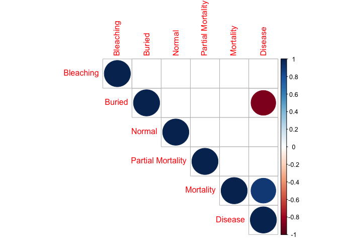
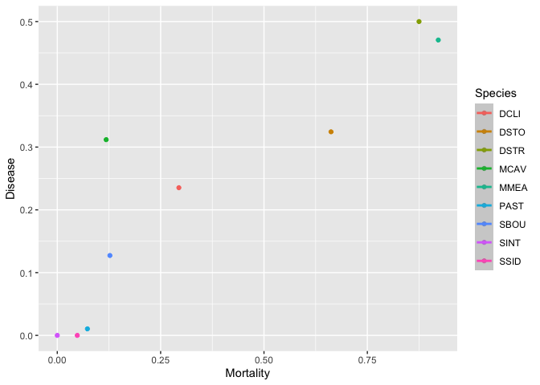

State Correlation Analyses
================

Markdown code for the survival analyses of the Port of Miami data
examining the main effects of channel (i.e. dredging impact), reef
habitat, and direction. Survival analyses used to tease apart species
specific differences as well as the impact of state (or condition)
specifically whether the corals were observed to be buried, bleached or
diseased. Each variable is coded as 0 (absence) or 1 (presence) as well
as in combination in the states column.

``` r
rm(list = ls())
knitr::opts_chunk$set(echo = TRUE, error = FALSE, fig.path='Figures/', dev=c('png', 'pdf'))
```

All figures exported to Figures/folder as png and pdf

``` r
library(knitr)
library(survival)
library(coda)
library(survminer)
```

    ## Loading required package: ggplot2

    ## Loading required package: ggpubr

``` r
library(dplyr)
```

    ## 
    ## Attaching package: 'dplyr'

    ## The following objects are masked from 'package:stats':
    ## 
    ##     filter, lag

    ## The following objects are masked from 'package:base':
    ## 
    ##     intersect, setdiff, setequal, union

``` r
library(ggplot2)
library(car)
```

    ## Loading required package: carData

    ## 
    ## Attaching package: 'car'

    ## The following object is masked from 'package:dplyr':
    ## 
    ##     recode

``` r
library(tidyverse)
```

    ## ── Attaching packages ─────────────────────────────────────── tidyverse 1.3.0 ──

    ## ✓ tibble  3.0.4     ✓ purrr   0.3.4
    ## ✓ tidyr   1.1.2     ✓ stringr 1.4.0
    ## ✓ readr   1.4.0     ✓ forcats 0.5.0

    ## ── Conflicts ────────────────────────────────────────── tidyverse_conflicts() ──
    ## x dplyr::filter() masks stats::filter()
    ## x dplyr::lag()    masks stats::lag()
    ## x car::recode()   masks dplyr::recode()
    ## x purrr::some()   masks car::some()

``` r
library(kableExtra)
```

    ## 
    ## Attaching package: 'kableExtra'

    ## The following object is masked from 'package:dplyr':
    ## 
    ##     group_rows

``` r
#library(gtsummary) #not loading properly
```

``` r
df=read.csv("9sp_corr.csv") #time by months; excludes missing corals
glimpse(df)
```

    ## Rows: 63
    ## Columns: 5
    ## $ Species           <chr> "DCLI", "DSTO", "DSTR", "MCAV", "MMEA", "PAST", "SB…
    ## $ Condition         <chr> "Mortality", "Mortality", "Mortality", "Mortality",…
    ## $ Value             <int> 5, 49, 14, 11, 47, 7, 14, 0, 3, 4, 24, 8, 29, 24, 1…
    ## $ Total.Individuals <int> 17, 74, 16, 93, 51, 96, 110, 41, 62, 17, 74, 16, 93…
    ## $ Percentage        <dbl> 0.29411765, 0.66216216, 0.87500000, 0.11827957, 0.9…

``` r
df %>% filter(Condition %in% c("Bleaching","Disease","Mortality")) %>%
     ggplot(aes(fill=Condition, y=Percentage, x = Species)) +
        geom_bar(position = "fill", stat = "identity")
```

<!-- -->

``` r
library(reshape2)
```

    ## 
    ## Attaching package: 'reshape2'

    ## The following object is masked from 'package:tidyr':
    ## 
    ##     smiths

``` r
df_w <- dcast(df, Species ~ Condition, value.var="Percentage")
df_w
```

    ##   Species  Bleaching     Buried    Disease  Mortality     Normal Partial Burial
    ## 1    DCLI 0.00000000 0.00000000 0.23529412 0.29411765 0.05882353      0.7647059
    ## 2    DSTO 0.01351351 0.04054054 0.32432432 0.66216216 0.04054054      0.6621622
    ## 3    DSTR 0.06250000 0.00000000 0.50000000 0.87500000 0.00000000      0.2500000
    ## 4    MCAV 0.07526882 0.00000000 0.31182796 0.11827957 0.24731183      0.5268817
    ## 5    MMEA 0.21568628 0.00000000 0.47058824 0.92156863 0.01960784      0.5490196
    ## 6    PAST 0.15625000 0.07291667 0.01041667 0.07291667 0.37500000      0.4895833
    ## 7    SBOU 0.01818182 0.06363636 0.12727273 0.12727273 0.10909091      0.7727273
    ## 8    SINT 0.46341463 0.09756098 0.00000000 0.00000000 0.07317073      0.8292683
    ## 9    SSID 0.12903226 0.09677419 0.00000000 0.04838710 0.38709677      0.4838710
    ##   Partial Mortality
    ## 1         0.6470588
    ## 2         0.4324324
    ## 3         0.2500000
    ## 4         0.2580645
    ## 5         0.3921569
    ## 6         0.2187500
    ## 7         0.6454545
    ## 8         0.4878049
    ## 9         0.3548387

``` r
#Select 
df_corr <- df_w %>% select(Mortality, Buried, Disease, Bleaching, Normal, "Partial Mortality")
head(df_corr)
```

    ##    Mortality     Buried    Disease  Bleaching     Normal Partial Mortality
    ## 1 0.29411765 0.00000000 0.23529412 0.00000000 0.05882353         0.6470588
    ## 2 0.66216216 0.04054054 0.32432432 0.01351351 0.04054054         0.4324324
    ## 3 0.87500000 0.00000000 0.50000000 0.06250000 0.00000000         0.2500000
    ## 4 0.11827957 0.00000000 0.31182796 0.07526882 0.24731183         0.2580645
    ## 5 0.92156863 0.00000000 0.47058824 0.21568628 0.01960784         0.3921569
    ## 6 0.07291667 0.07291667 0.01041667 0.15625000 0.37500000         0.2187500

``` r
res <- cor(df_corr)
round(res,2)
```

    ##                   Mortality Buried Disease Bleaching Normal Partial Mortality
    ## Mortality              1.00  -0.66    0.90     -0.24  -0.68             -0.16
    ## Buried                -0.66   1.00   -0.89      0.48   0.51              0.08
    ## Disease                0.90  -0.89    1.00     -0.37  -0.66             -0.17
    ## Bleaching             -0.24   0.48   -0.37      1.00   0.02             -0.11
    ## Normal                -0.68   0.51   -0.66      0.02   1.00             -0.43
    ## Partial Mortality     -0.16   0.08   -0.17     -0.11  -0.43              1.00

``` r
library(Hmisc)
```

    ## Loading required package: lattice

    ## Loading required package: Formula

    ## 
    ## Attaching package: 'Hmisc'

    ## The following objects are masked from 'package:dplyr':
    ## 
    ##     src, summarize

    ## The following objects are masked from 'package:base':
    ## 
    ##     format.pval, units

``` r
res2 <-rcorr(as.matrix(df_corr))
res2
```

    ##                   Mortality Buried Disease Bleaching Normal Partial Mortality
    ## Mortality              1.00  -0.66    0.90     -0.24  -0.68             -0.16
    ## Buried                -0.66   1.00   -0.89      0.48   0.51              0.08
    ## Disease                0.90  -0.89    1.00     -0.37  -0.66             -0.17
    ## Bleaching             -0.24   0.48   -0.37      1.00   0.02             -0.11
    ## Normal                -0.68   0.51   -0.66      0.02   1.00             -0.43
    ## Partial Mortality     -0.16   0.08   -0.17     -0.11  -0.43              1.00
    ## 
    ## n= 9 
    ## 
    ## 
    ## P
    ##                   Mortality Buried Disease Bleaching Normal Partial Mortality
    ## Mortality                   0.0515 0.0011  0.5409    0.0459 0.6845           
    ## Buried            0.0515           0.0014  0.1878    0.1594 0.8397           
    ## Disease           0.0011    0.0014         0.3269    0.0536 0.6549           
    ## Bleaching         0.5409    0.1878 0.3269            0.9687 0.7717           
    ## Normal            0.0459    0.1594 0.0536  0.9687           0.2449           
    ## Partial Mortality 0.6845    0.8397 0.6549  0.7717    0.2449

``` r
library(corrplot)
```

    ## corrplot 0.84 loaded

``` r
corrplot(res, type = "upper", order = "hclust",
         tl.col = "black", tl.srt = 45)
```

<!-- -->

``` r
# Insignificant correlation are crossed
corrplot(res2$r, type="upper", order="hclust", 
         p.mat = res2$P, sig.level = 0.01, insig = "blank")
# Insignificant correlations are leaved blank
corrplot(res2$r, type="upper", order="hclust", 
         p.mat = res2$P, sig.level = 0.01, insig = "blank")
```

<!-- -->

``` r
ggplot(data=df_w, mapping = aes(x = Mortality, y = Disease, color = Species)) +
  geom_point() +
  geom_smooth(method = "lm")
```

    ## `geom_smooth()` using formula 'y ~ x'

<!-- -->
